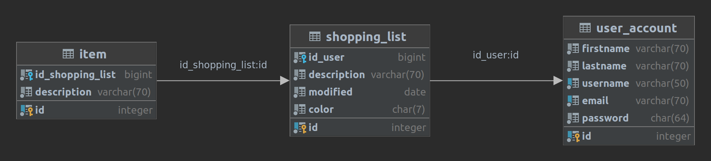

# Chorlist

This project was done as an assignment for a university course Development of Applications for Mobile and Smart Devices.

## Domain description

The domain of the native Android application *Chorlist* consists of keeping records of obligations to purchase various products.

Users will have the option of adding products and categorizing products into their predefined categories - shopping lists. When the user acquires the requested product, it can be marked and disappear from the shopping list. When all products from the shopping list have been purchased, the list is automatically deleted. Additionally, if the user prefers to use the shopping list in paper form, the application will allow printing the shopping list into a PDF document, which can then be printed.

Suppose several users want to jointly add products to shopping lists. In that case, they log in with the same user account, and the application automatically periodically checks whether there has been a change in their shopping lists.

## Definitions, acronyms, abbreviations

- Shopping list: shopping list, used for easier organization of products
- Products (items): groceries and/or other necessities that can be bought and grouped in a shopping list

## List of functional requirements

Label  | Name                                     | Short description
------  | ----------------------------------------- | ----------------------------------------------------------------------------------------------------------
F01 | Registration | The system will enable registration for new users.
F02 | Login | The system will allow access only to authenticated users.
F03 | Profile | The system will enable editing of the user profile, including logging out.
F04 | Management of obligations | The system will enable the addition of new obligations and the modification and deletion of existing ones.
F05 | Synchronization of obligations | The system will enable the synchronization of obligations with multiple users logged in to the same user account.
F06 | Categorization of obligations into shopping lists | The system will enable the organization of obligations by user-defined categories.
F07 | Obligations search | The system will enable the search of all obligations.
F08 | Widget | The system will enable the creation of widgets - the display of the selected shopping list and the deletion and addition of obligations.
F09 | Print shopping list | The system will enable the creation of a PDF document where shopping lists are displayed together with their obligations.

## Project architecture

The diagram shows the architecture of the future mobile application at the most abstract level.

## Entity relationship diagram

## Technologies and equipment

- Android Studio (Android SDK)
- Kotlin
- NodeJS
- PostgreSQL

## Launching the application

- install PostgreSQL and load the SQL script (instructions given in Software/Database)
- start the NodeJS server (cd Software/Service; npm i; npm start)
- load the Software/Application project into Android Studio and run it

Note: The app is tested with Pixel 4 API 30 version. On larger versions, it is questionable whether PDF export will work due to newly created Google restrictions for storage permissions.
